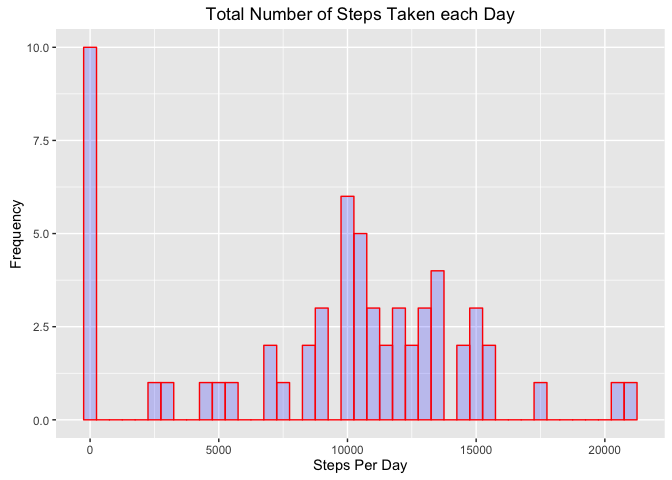
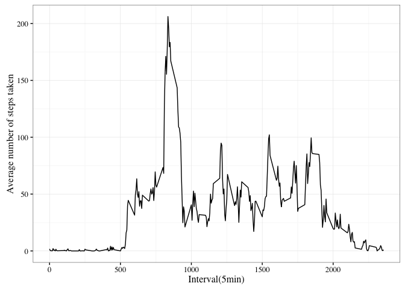

# Reproducible Research: Peer Assessment 1


## Loading and preprocessing the data

###1. Load the data (i.e.read.csv())

```r
library(readr)
library(data.table)
library(ggplot2)
library(stringr)

if(!file.exists('activity.csv')){
        unzip('activity.zip')
}
activity_dt <- read_csv('activity.csv')
```

```
## Parsed with column specification:
## cols(
##   steps = col_integer(),
##   date = col_date(format = ""),
##   interval = col_integer()
## )
```

###2. Process/transform the data (if neccessary) into a format duitable for your analysis

## What is mean total number of steps taken per day ?

###1. Calculate the total number of steps taken per day 

```r
DT<-data.table(activity_dt)
#DT<-DT[complete.cases(DT$steps)]
StepsByDay<-DT[,sum(na.omit(steps)),by=.(date)]
setnames(StepsByDay,c("Date","TotalStepsPerDay"))
```
###2. Make a histogram of total number of steps taken each day.

```r
StepsByDay[,qplot(TotalStepsPerDay,
        xlab='Steps Per Day',
        ylab='Frequency',
        geom="histogram",
        main='Total Number of Steps Taken each Day',
        binwidth=500,
        alpha=I(.2),
        fill=I("blue"),
        col=I("red")
        )]
```

<!-- -->

###3. Calculate and report the mean and median of the total number of steps taken per day.


```r
out<-StepsByDay[,.(mean(na.omit(TotalStepsPerDay)),median(na.omit(TotalStepsPerDay)))]
```

Mean: 9354.2295082

Median: 10395

## What is the average daily activity pattern ?

### 1. Make a time series plot(i.e. type = "1") of the 5-minute interval (x-axis) and the average number of steps taken, averaged across all days (y-axis)


```r
avgStepsByInterval<-DT[,mean(na.omit(steps)),by=.(interval)]
setnames(avgStepsByInterval,c("interval","avgStepsTakenPerInterval"))
ggplot(avgStepsByInterval, 
        aes(x = interval, y = avgStepsTakenPerInterval)) +
        geom_line() + 
        xlab("Interval(5min)") +
        ylab("Average number of steps taken") +
        theme_bw(base_family="Times")
```

<!-- -->

### 2. Which 5-minute interval, on average across all the days in the dataset, contains the maximum number of steps?


```r
MaxSteps<-which.max(avgStepsByInterval$avgStepsTakenPerInterval)
c<-avgStepsByInterval[MaxSteps,interval]
IntervalWithMaxSteps<-paste(str_sub(c,0,nchar(c)-2),':',str_sub(c,nchar(c)-1,nchar(c)),sep="")
```
Time With Max Steps Taken: 8:35
