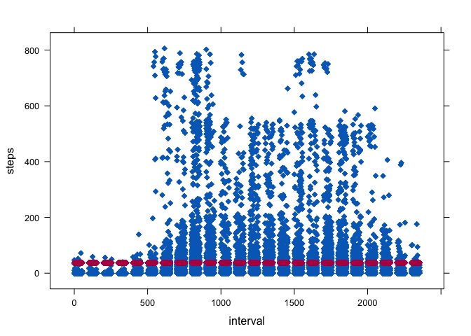

# Reproducible Research: Peer Assessment 1

knit2html("PA1_template.Rmd")
browseURL("PA1_template.html")


## Loading and preprocessing the data


```r
library("knitr")
knit2html("file")
```

```
Warning in readLines(con): cannot open file 'file': No such file or
directory
```

```
Error in readLines(con): cannot open the connection
```

```r
library(readr)
library(data.table)
library(ggplot2)
library(stringr)
library(mice)
```

```
Loading required package: Rcpp
```

```
mice 2.25 2015-11-09
```

```r
library(VIM)
```

```
Loading required package: colorspace
```

```
Loading required package: grid
```

```
VIM is ready to use. 
 Since version 4.0.0 the GUI is in its own package VIMGUI.

          Please use the package to use the new (and old) GUI.
```

```
Suggestions and bug-reports can be submitted at: https://github.com/alexkowa/VIM/issues
```

```

Attaching package: 'VIM'
```

```
The following object is masked from 'package:datasets':

    sleep
```

```r
setwd("/Users/donttouch/DScience/ReproducibleResearch/W2")
```

###1. Load the data (i.e.read.csv())


```r
if(!file.exists('activity.csv')){
        unzip('activity.zip')
}
activity_dt <- read.csv('activity.csv')
```

###2. Process/transform the data (if neccessary) into a format duitable for your analysis

## What is mean total number of steps taken per day ?

###1. Calculate the total number of steps taken per day 

```r
DT<-data.table(activity_dt)
StepsByDay<-DT[,sum(na.omit(steps)),by=.(date)]
setnames(StepsByDay,c("Date","TotalStepsPerDay"))
```
###2. Make a histogram of total number of steps taken each day.

```r
StepsByDay[,qplot(TotalStepsPerDay,
        xlab='Steps Per Day',
        ylab='Frequency',
        geom="histogram",
        main='Total Number of Steps Taken each Day',
        binwidth=500,
        alpha=I(.2),
        fill=I("blue"),
        col=I("red")
        )]
```

<!-- -->

###3. Calculate and report the mean and median of the total number of steps taken per day.


```r
out<-StepsByDay[,.(mean(na.omit(TotalStepsPerDay)),median(na.omit(TotalStepsPerDay)))]
```

Mean: 9354.2295082

Median: 10395

## What is the average daily activity pattern ?

### 1. Make a time series plot(i.e. type = "1") of the 5-minute interval (x-axis) and the average number of steps taken, averaged across all days (y-axis)


```r
avgStepsByInterval<-DT[,mean(na.omit(steps)),by=.(interval)]
setnames(avgStepsByInterval,c("interval","avgStepsTakenPerInterval"))
ggplot(avgStepsByInterval, 
        aes(x = interval, y = avgStepsTakenPerInterval)) +
        geom_line() + 
        xlab("Interval(5min)") +
        ylab("Average number of steps taken") +
        theme_bw(base_family="Times")
```

<!-- -->

### 2. Which 5-minute interval, on average across all the days in the dataset, contains the maximum number of steps?


```r
MaxSteps<-which.max(avgStepsByInterval$avgStepsTakenPerInterval)
c<-avgStepsByInterval[MaxSteps,interval]
IntervalWithMaxSteps<-paste(str_sub(c,0,nchar(c)-2),':',str_sub(c,nchar(c)-1,nchar(c)),sep="")
```

Time With Max Steps Taken: 8:35

## Inputing Missing Values

### 1. Calculate and Report number of missing values in the dataset (i.e. the total number of Rows with NAs)


```r
#pMiss <- function(x){sum(is.na(x))/length(x)*100}
#apply(activity_dt,2,pMiss)
#apply(activity_dt,1,pMiss)
RowsWithNAs<-md.pattern(activity_dt)
```

```
      date interval steps     
15264    1        1     1    0
 2304    1        1     0    1
         0        0  2304 2304
```
The output tells us that 15264 cases are complete and  2304 samples miss Steps measurement.

### 2. Devise a strategy for filling in all of the missing values in the dataset. The strategy does not need to be sophisticated. For example, you could use the mean/median for that day, or the mean for that 5-minute interval, etc

We can impute missing data by using predictive mean matching as imputation method. The mice() function would takes care
of the imputing process.

### 3. Create a new dataset that is equal to the original dataset but with the missing data filled in.


```r
tempDT <- mice(activity_dt, m=5, maxit=5,meth='mean',seed=500)
```


```r
completeDT <- complete(tempDT,1)
```

Check distribution of orginal and imputed data using xyplot plot.

*Shape of the magenta points (imputed) matches the shape of the blue ones (observed).*


```r
library(lattice)
xyplot(tempDT,steps ~ interval,pch=18,cex=1)
```

<!-- -->

### 4. Make a histogram of the total number of steps taken each day and Calculate and report the mean and median total number of steps taken per day. Do these values differ from the estimates from the first part of the assignment? What is the impact of imputing missing data on the estimates of the total daily number of steps?

*Histogram of the total number of steps taken each day*


```r
DTImputed<-data.table(completeDT)
StepsByDayImputed<-DTImputed[,sum(na.omit(steps)),by=.(as.Date(date,,'%Y-%m-%d'))]
setnames(StepsByDayImputed,c("Date","TotalStepsPerDay"))
```
<!-- -->

*The mean and median total number of steps per day*


```r
out<-StepsByDayImputed[,.(mean(na.omit(TotalStepsPerDay)),median(na.omit(TotalStepsPerDay)))]
```

Mean-Imputed: 1.0766189\times 10^{4}

Median-Imputed: 1.0766189\times 10^{4}

## Are there differences in activity patterns between weekdays and weekends?

## 1.Create a new factor variable in the dataset with two levels – “weekday” and “weekend” indicating whether a given date is a weekday or weekend day.


```r
DTImputed[,dayOfWeek:=ifelse(wday(as.Date(date,'%Y-%m-%d')) %in% c(0,6), 'weekend', 'weekday')]
```

## 2. Make a panel plot


```r
avgStepsByDayIntervalImputed<-DTImputed[,AvgSteps:=mean(steps),by=list(interval,dayOfWeek)]
```


```r
ggplot(avgStepsByDayIntervalImputed,aes(interval,AvgSteps)) +
geom_line() +
facet_grid(dayOfWeek ~ .) +
xlab("5-min Interval") +
ylab("Avg Number of Steps")
```

<!-- -->
